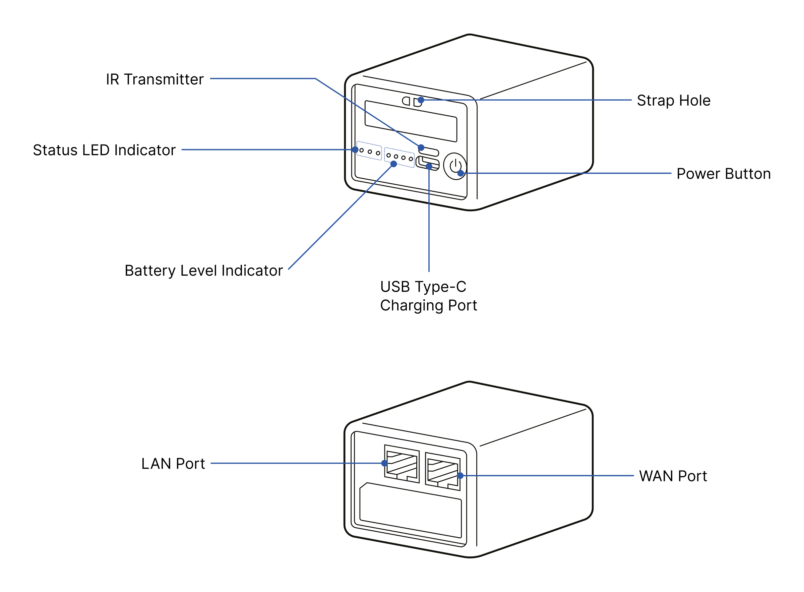

# Device layout

### Device Layout

#### ⚠︎Caution

- Please maintain the recommended temperature range (0&#126;40°C / 32&#126;104°F) when storing/using the device.   
(Using outside the recommended temperature range may shorten battery life and cause swelling.)

- Please use the provided silicone cover when using the device.

- Please make sure to use a USB charger that supports 5V DC output.  
(It is generally compatible with commonly used USB power banks and chargers, including USB Quick Charge chargers. 
However, for safe use, please ensure that the charger's specifications include an output voltage of 5V/2A DC.)