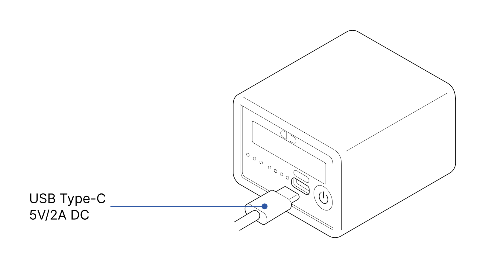
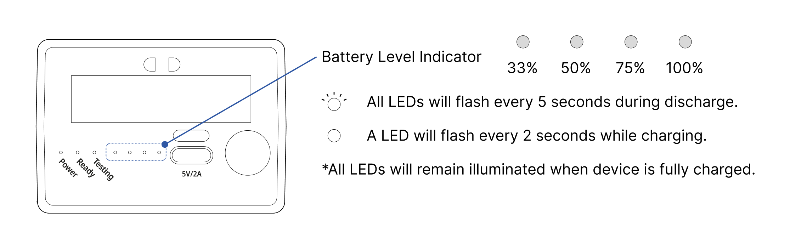

# Charging the battery

### How to charge device.

- Fully charging the device before initial use is recommended.

- Package includes USB Type-A to C charging cable.

- If the device is fully charged, all four battery level indicator LEDs will remain illuminated.

### Understanding battery level indicator.

### How to check the battery level.

A short press of the 'Power Button' will trigger the battery level indicator to blink three times, 
indicating the remaining battery level of the device.