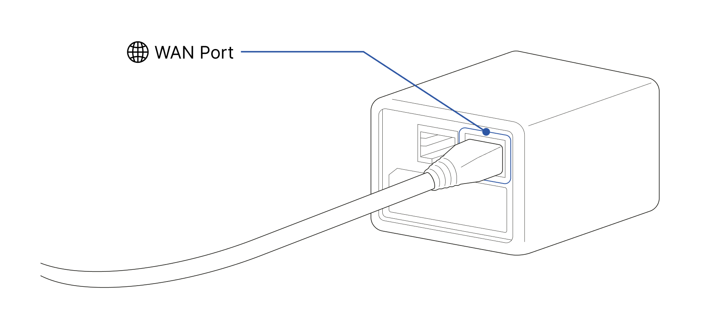
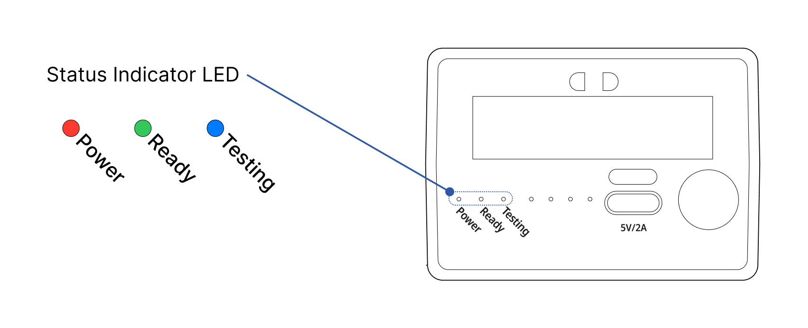
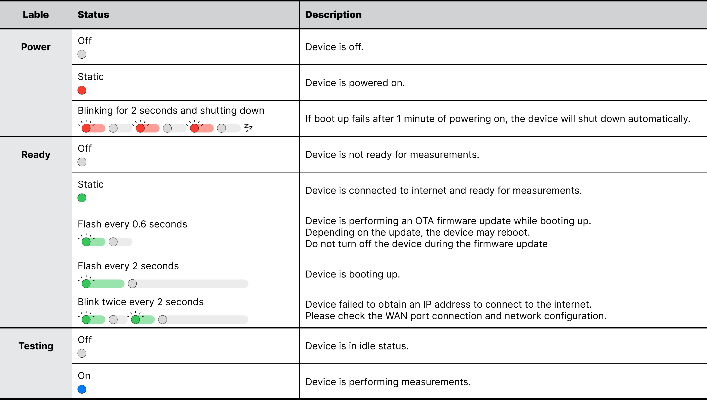
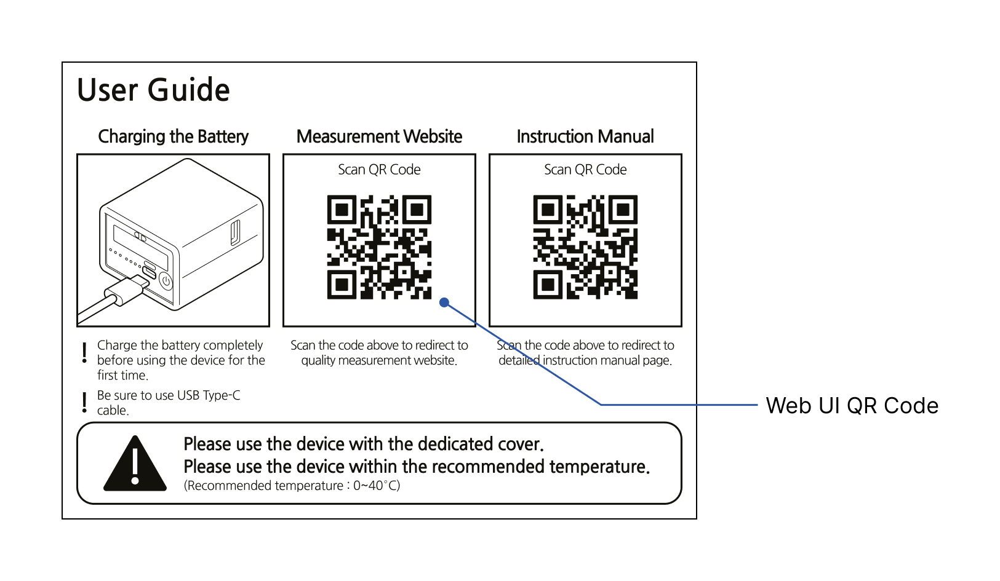
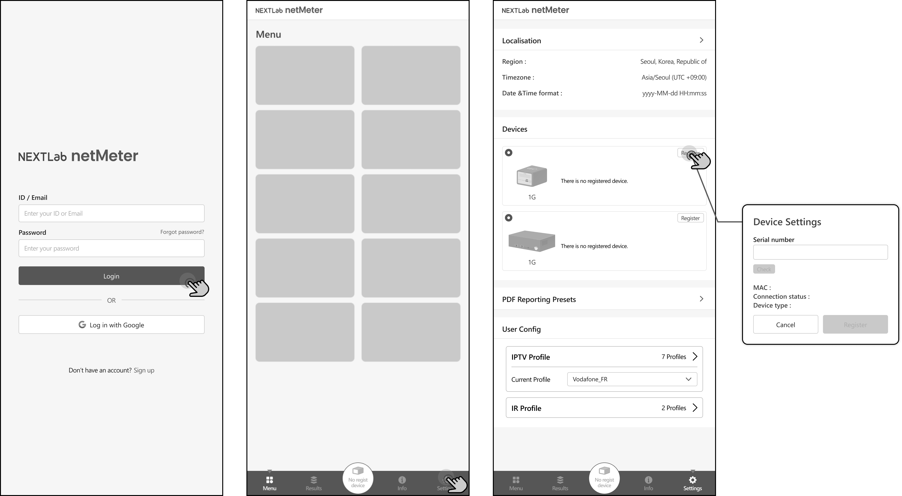
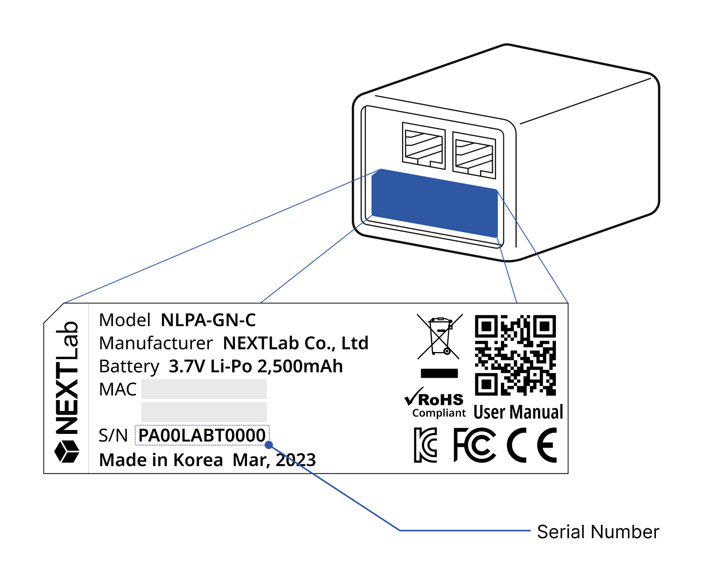

# Getting Started

### Connecting device to WAN

netMeter operates through a cloud-based web UI. To control netMeter via the web UI, 
netMeter must be able to obtain an IP address to connect to the internet.

Please correctly plug in an internet-connectable LAN cable into the WAN port (RJ-45) of netMeter. 
It is located on the back right side of the device.

### Powering ON

If you press and hold the 'Power Button' for more than 1 second, the device's power will turn on.
When the device is powered on, the 'Power' LED on the status indicator will illuminate in red.

While the device is booting up, the 'Ready' LED on the status indicator will flash every 2 seconds.

If the device doesn't boot up normally within 1 minute after powering on, it will flash the 'Power' LED 
for 2 seconds and then automatically shut down. If this happens, please contact our customer service department 
as there may be an issue with the device.

Once the boot process is complete and the device is ready and online, the 'Ready' LED will remain illuminated.

If the device fails to obtain an IP address to connect to the internet, the 'Ready' LED will blink twice every 2 seconds.

### Understanding status LED indicator.

### Web UI

netMeter is operated through a cloud-based web UI and is not dependent on device platforms, 
allowing remote operation from anywhere.

Inside the package, you can find a user guide with a QR code to visit the Web UI to control 
netMeter. You can also visit via [Link](https://app.netmeter.io/)

### Registering device to account

#### ⚠︎Before start
- The device must obtain an IP address and be connected online in order to register.
  Please check if the 'Ready' status LED indicator is showing a steady green light.

Device must be registered to the netMeter user’s account in order to use it.
To do so, log in to the 'Web UI'. Navigate to the 'Settings' menu, 
then under the 'Devices' setting, you will find the 'Register' button. 
(Web UI > Settings > Devices > Register)

Enter the device’s serial number to register it to your account.
The serial number can be found on a label located on the back of the device.

If the device is registered correctly, you can see the corresponding device on your devices list.