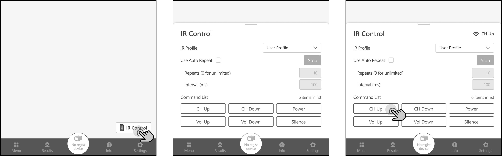

# IR Remote Control

The IR Remote Control feature enables users to transmit IR signals using netMeter to control 
IPTV set-top boxes or other peripheral devices that can be controlled by IR signals. 
This facilitates various testing scenarios where IR Controls are required.

IR Control is globally accessible by expanding the Control Panel from the bottom status bar and 
can be executed simultaneously with other measurement actions.

Users can select the IR Profile, which is pre-configured in the IR Profile settings menu. 
(Settings > User Config > IR Profile)

The IR commands associated with the profile will be displayed in the Command List.

By clicking or tapping a command button, the user can transmit the corresponding IR command.

import bottomStatusBar from "../img/BottomStatusBar.png"

While an IR signal is being transmitted, the command name of the IR signal will be displayed on the 
status bar with an icon.

You can locate the IR transmitter of the netMeter in the Device Layout section corresponding to the 
model in the startup guide. Ensure that the target device's IR receiver is lined up with netMeter's IR transmitter.

## Auto Repeat

When the "Use Auto Repeat" option is checked, netMeter will automatically transmit the IR command repeatedly 
after the user triggers the button, according to the configured repeat time and interval. 
Even when the control panel is closed, repetition will continue in the background.

If "Repeats" is set to 0, netMeter will repeat the triggered command infinitely until the user manually 
interrupts by pressing the stop button.

Auto Repeat can be interrupted at any time by pressing the stop button. During automatic repetition, 
interaction with other command buttons will be disabled.