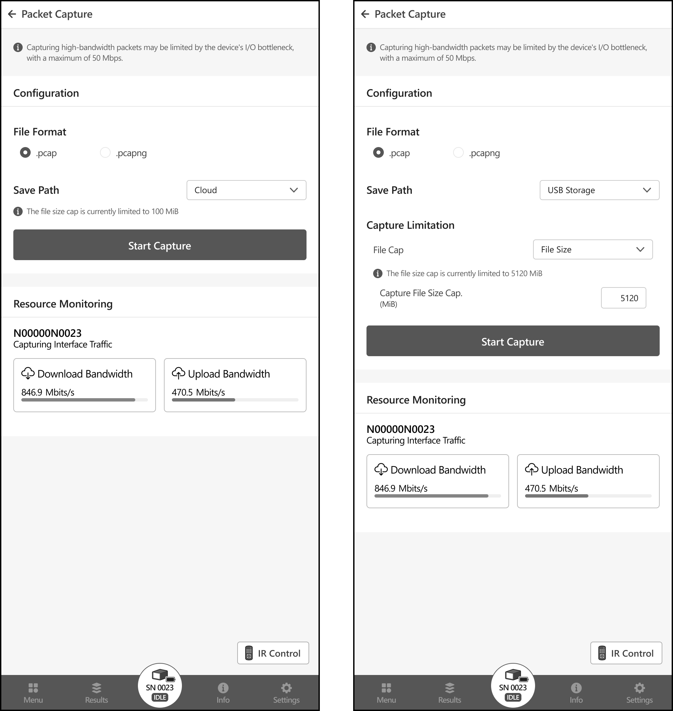

# Packet Capture

The Packet Capture feature captures incoming and outgoing packets through the "LAN" port of the netMeter. 
You can locate the LAN port of the netMeter in the Device Layout section corresponding to the model in the start guide.

[//]: # (#### **⚠︎CBT Notice:** In the Closed Beta Test stage, the maximum packet capture file size is capped at 100 MB.)

## File Format

Support for saving packet capture files in .pcap and .pcapng formats is provided.

[//]: # (## Cloud Support)

[//]: # ()
[//]: # (After the capture is completed, you can upload the packet capture file to the cloud.)

[//]: # ()
[//]: # (When capturing packets with excessively high bandwidth, there may be cases where some packets are not captured )

[//]: # (intact due to I/O bottlenecks. Before uploading, users can check the packet drop rate of the captured file.)

[//]: # ()
[//]: # (import packetCaptureUpload from "../img/PacketCaptureUpload.png")

[//]: # ()
[//]: # ()

## Save Path

Users can choose to save captured files to a USB removable storage device connected to netMeter or to cloud storage.

When capturing packets with excessively high bandwidth, some packets may not be captured intact due to I/O bottlenecks. 
After the capture is completed, users can check the packet drop rate of the captured file and choose 
whether to save or discard the captured file.

import packetCaptureUpload from "../img/PacketCaptureUpload.png"

The default capture file name is set to the device's name followed by the timestamp of when the capture started. 

## Results History

If you select cloud storage as the save path, you can download the capture file from the History at any time 
once the upload is complete.
Even if the netMeter is located remotely, users can still access it from any device through the WebUI 
to download the capture file at any time.