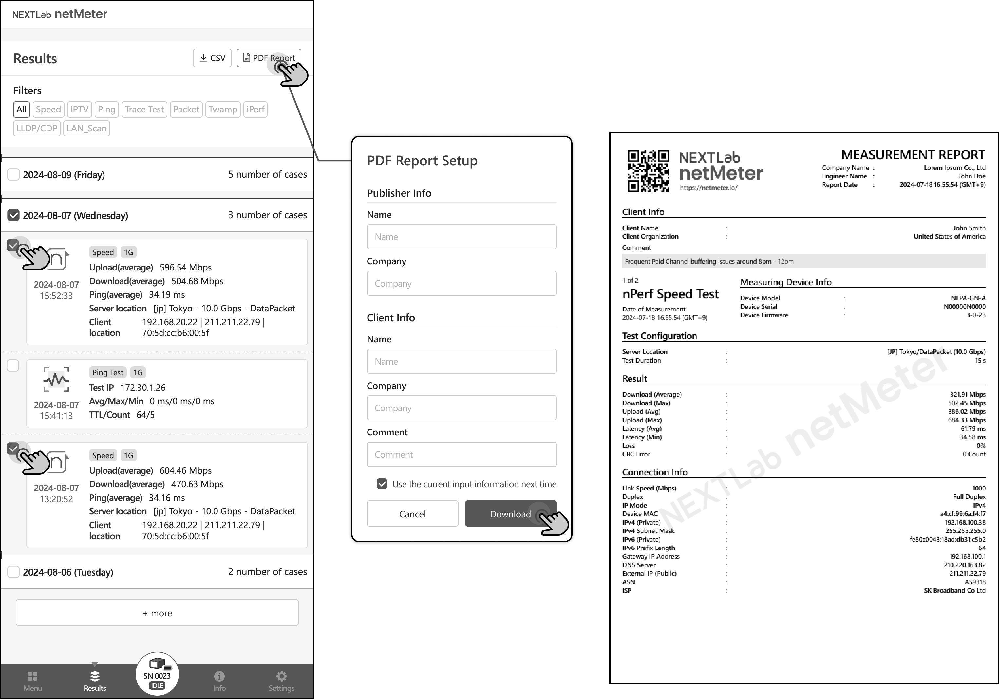

# PDF Report

User can export measurement results to PDF Report.

At the time of export, you can enter Publisher Info and Client Info to be included in the report. 
Default Publisher Info can also be set in (Settings > PDF Reporting Preset).

From the result history list, select one or more measurements to export as a PDF report, 
then click the PDF Report button to download the PDF report for the selected measurements.
The report includes not only the results of the measurement 
but also the Test Configuration and device information from the time the measurement was performed.