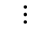

# IPTV Profile

The IPTV Profile must be pre-configured for IPTV testing purposes.
The IPTV Profile includes multiple multicast address entries.

import iptvDropdown from "../img/IPTVDropdown.png"

This profile is set globally. 
To make changes, you can change the applied IPTV profile through the dropdown menu of the current profile.

## Creating IPTV Profile

To configure an IPTV Profile, first create a new one by clicking the “Create new IPTV Profile” button.

Profiles created by the user will be displayed in the list.

To manage or edit the channel lists of an IPTV profile, clicking the corresponding profile will 
navigate to the IPTV profile management page. On this page, users can manually register channel lists 
by adding multicast IP addresses and metadata for channels.

## Manage IPTV Profile

import manageIPTVProfile from "../img/ManageIPTVProfile.png"

### Manual Register

**Channel category:** Define the properties of the multicast address. This property cannot be modified after registration.

**IPTV:** Multicast addresses that include regular IPTV streams. The MPEG-2 TS Quality Measurement only supports this category of multicast streams.

- **CH#:** Known channel number
- **Name:** Known channel name
- **Region Code:** Channel’s region code
- **IP:** Multicast IP address of the channel
- **Port:** Multicast address’s port of the channel

**OOB:** Multicast addresses for EPG or miscellaneous data streams.

- **Name:** Known channel name or description
- **IP:** Multicast IP address of the channel
- **Port:** Multicast address’s port of the channel

**Add channel info:** Pressing the "Add channel info" button will add channel data to profile’s channel list.

### Auto Scan

#### **⚠︎CBT Notice:** In the Closed Beta Test stage, Auto Scan feature is not supported.

The Auto Scan feature enables users to automatically add IPTV channel information by scanning the EPG stream, 
which includes IPTV channel information encoded in the SDT (Service Description Table) format.

For this feature to work, the Multicast IP address and port of the EPG stream containing channel information 
are required, and it must comply with the SDT standard.

Once the IP and port are entered, clicking the "Scan channels from EPG" button will automatically 
scan the IPTV channel addresses from the EPG stream and add them to the Channel List. This process may take some time.

### **Channel list**

#### **⚠︎CBT Notice:** In the Closed Beta Test stage, Import / Export feature is not supported.

The list of channel information associated with the IPTV profile is displayed.

Users can delete or edit each channel information by clicking this icon.