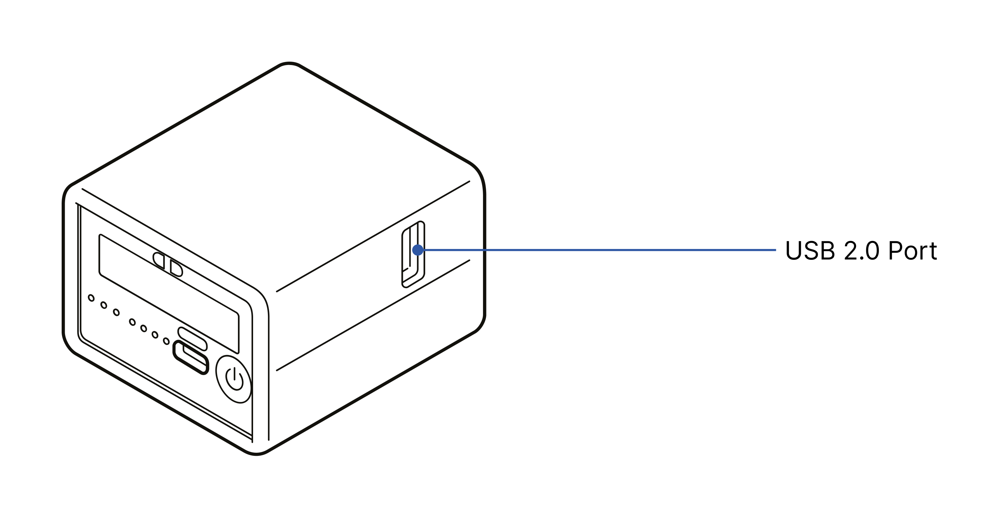
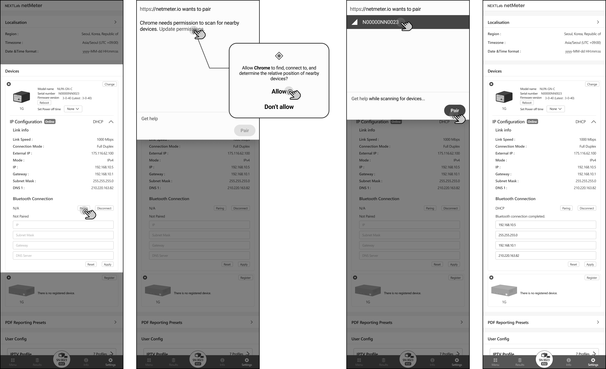
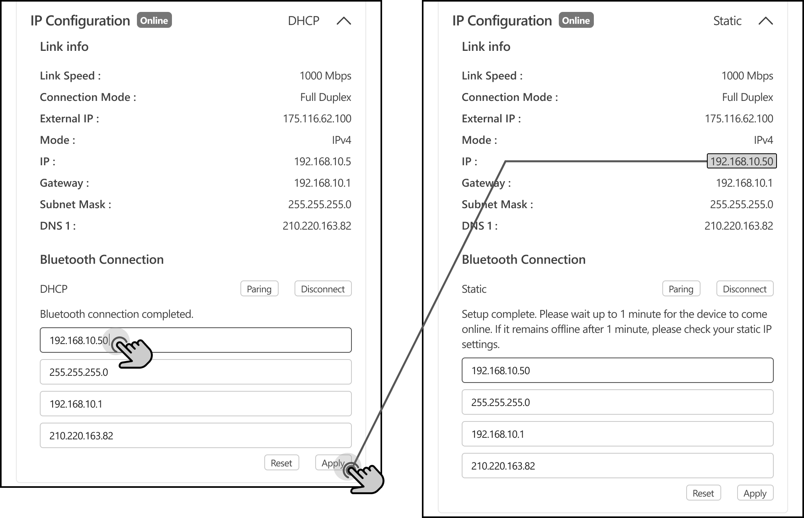
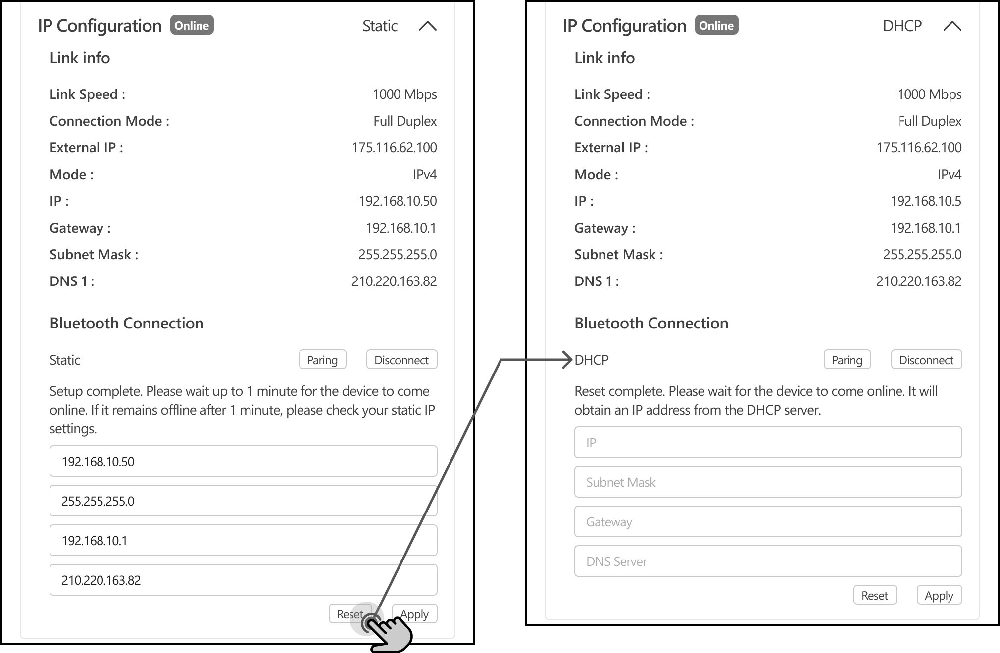

# DHCP / Static IP

The netMeter supports both static IP and DHCP methods for obtaining an IP address from a router.     
This functionality is enabled by connecting a Bluetooth USB dongle to the netMeter device that supports USB port expansion.

⚠︎ This feature relies on the Web Bluetooth API, and is **only supported on Chrome and Edge browsers for Windows, Mac, Linux, and Android.** Apple iOS is not supported. For details, refer to [MDN Web Bluetooth API Browser Compatibility.](https://developer.mozilla.org/en-US/docs/Web/API/Web_Bluetooth_API)

Compatibility has been tested only with Bluetooth USB dongles that meet the following specifications.

- Realtek RTL8821CU chipset

No additional user actions are required to use these Bluetooth USB dongles, as they are natively supported in the latest firmware of the netMeter. 
For detailed technical support regarding compatible USB Bluetooth dongles, please contact [support-netmeter@nextlab.co.kr](mailto:support-netmeter@nextlab.co.kr)

## Pairing

With a compatible Bluetooth dongle attached to the netMeter, navigate to Settings > Devices > IP Configuration > Pairing Button.

When the Bluetooth pairing popup appears in the browser displaying netHUB, select the device that matches the serial number of your netMeter and proceed with pairing.

⚠︎ On some devices, the browser may request location access or permission to scan for nearby devices. Please allow these permissions in the browser app's security settings.

⚠︎ During the initial pairing or in some browsers, the serial number advertised by the netMeter may appear as "Unknown or Unsupported Device".

Once pairing is successfully completed, a message saying "Bluetooth connection completed" will appear, and the current netMeter Link Info will automatically display in the input field.

## Configuring Static IP

You can configure the information required for the netMeter to obtain an IP address from the router, including the IP, Subnet Mask, Gateway IP, and DNS Server, as needed.
After making the necessary changes, press the Apply button to apply the modifications.

Once the Apply button is pressed and the configuration is sent to the netMeter, it may appear in an Offline state until it receives the IP allocation based on the configured settings. If the netMeter successfully obtains the correct IP from the router and connects to the internet, the updated netMeter Link Info reflecting the new settings will be displayed, and the netMeter will appear Online.

If incorrect or conflicting IP information is entered, and the netMeter is unable to obtain an IP, it may remain in an Offline state. In such cases, please double-check the entered information and try again.

## Revert to DHCP

If there is an issue with the static IP configuration or you need to revert to the DHCP allocation method, you can reset the static IP settings by pressing the Reset button, which will restore the device to DHCP allocation mode.

During the process of changing the allocation method, the netMeter may appear Offline until it successfully obtains a valid IP address from the router and comes online.

Since a netMeter with a static IP configuration may not be able to access the internet, this process is performed via Bluetooth, allowing direct communication between the user's device and the netMeter.
