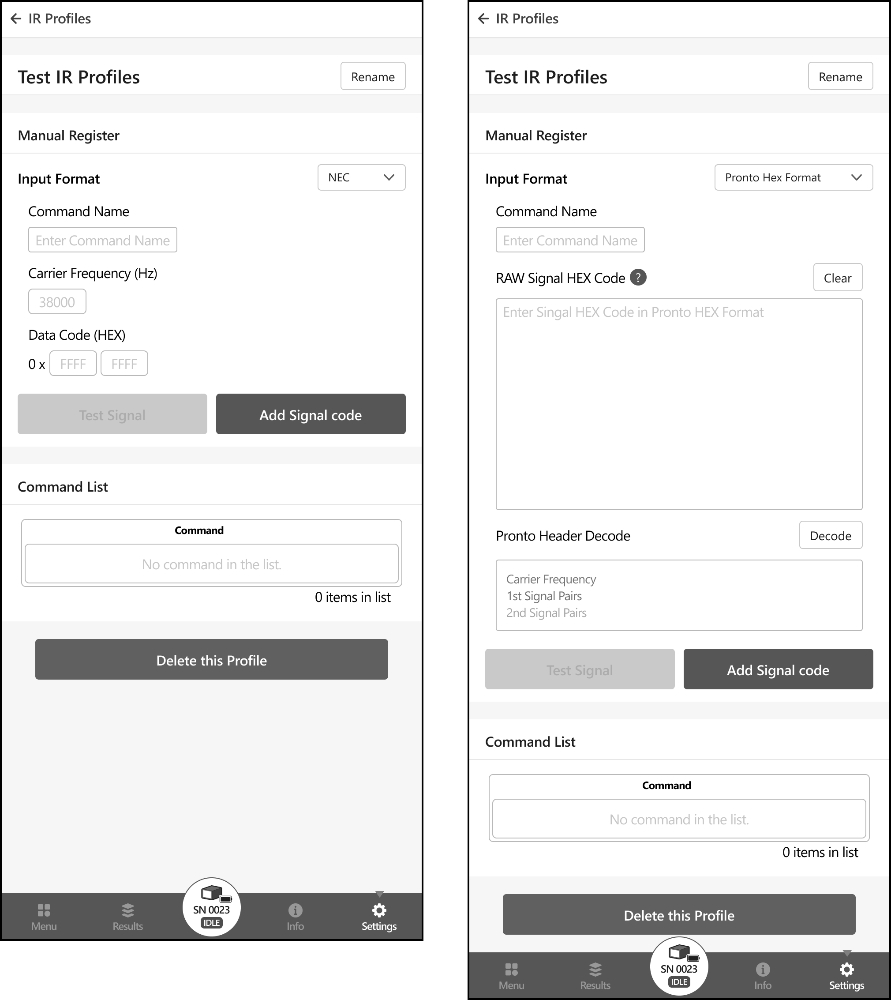

# IR Profile

To use the IR Remote Control feature from the Control Panel, IR Profiles must be pre-configured.
The IR Profiles configured here will be shown in the dropdown menu in the IR Remote Control UI.

import irDropdown from "../img/IRDropdown.png"

## Creating IR Profile

To configure an IR Profile, first create a new one by clicking the “Create new IR Profile” button.

Profiles created by the user will be displayed in the list.

To manage or edit the IR Command list of an IR profile, clicking the corresponding profile will navigate to the 
IR Profile management page. On this page, users can manually register IR Command lists by adding IR signal code 
and metadata for signal code.

## Manage IR Profile

### Manual Register

#### Input Format
Set the protocol defining the IR signal information. 
Supports NEC Protocol format and Pronto HEX format. This property cannot be modified after registration.

**NEC:** Register an IR signal using the NEC protocol.
  - **Command Name**: The label of the IR signal command that will be shown in the command list.
  - **Carrier Frequency (Hz)**: The carrier frequency of the IR signal, as defined by the manufacturer.
  - **Data Code (HEX)**: An 8-digit hexadecimal representing NEC data code (32-bit).

**Pronto HEX Format:** Register a RAW IR signal data using the Pronto HEX format. 
This allows you to input signal information for IR signals compliant with protocols other than NEC.
  - **Command Name**: Label of the IR signal command that will be shown in the command list.
  - **RAW Signal HEX Code**: Hexadecimal representation of the raw IR signal data used for remote control commands. 
It consists of a sequence of hexadecimal digits that encode the timing and modulation information required to reproduce 
an IR signal accurately. Each digit or pair of digits corresponds to a specific aspect of the IR signal.  
(For more information Pronto Hex Format, https://www.remotecentral.com/features/irdisp2.htm)
  - **Clear** button will erase all content entered in the form.
  - **Decode** button will interpret the Pronto Infrared Preamble only. 
This allows users to briefly check if the correct Pronto code has been provided. 
It does not imply integrity and verification for the entire Pronto HEX code.

**Test Signal:** The IR signal data provided by the user is transmitted using the IR transmitter of the netMeter. 
Users can verify whether the target device operates based on the entered IR signal code before it is added to the command list

**Add signal code:** Pressing the "Add signal code" button will add IR Signal data to profile’s Command list.

### **Command list**

#### **⚠︎CBT Notice:** In the Closed Beta Test stage, Import / Export feature is not supported.

The list of IR Commands associated with the IR profile is displayed.

Users can delete or edit each IR Commands by clicking this icon.