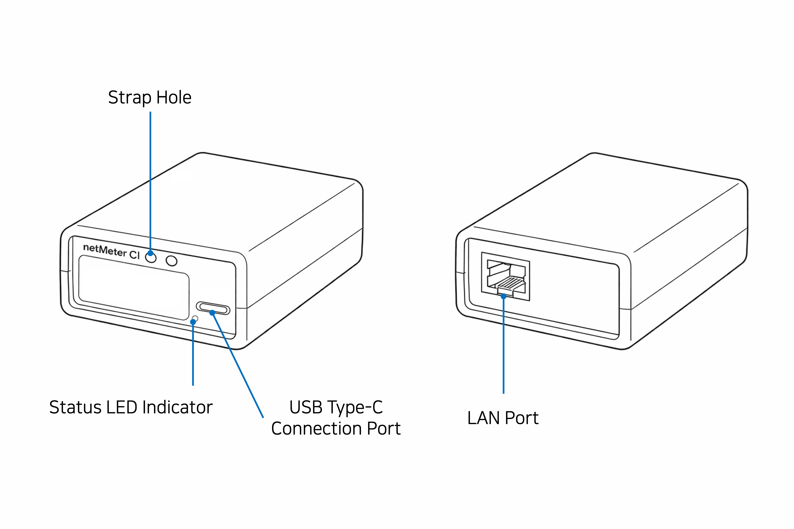

# Device layout

### Device Layout

#### ⚠︎Caution

- Please maintain the recommended temperature range (0&#126;40°C / 32&#126;104°F) when storing/using the device.  
  (Storage or transport in conditions outside the recommended temperature range may shorten the lifespan of the device.)

- Please use the provided silicone cover when using the device.
