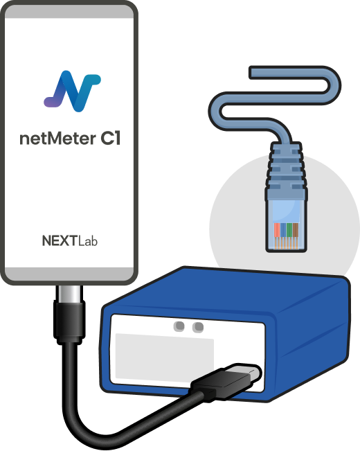
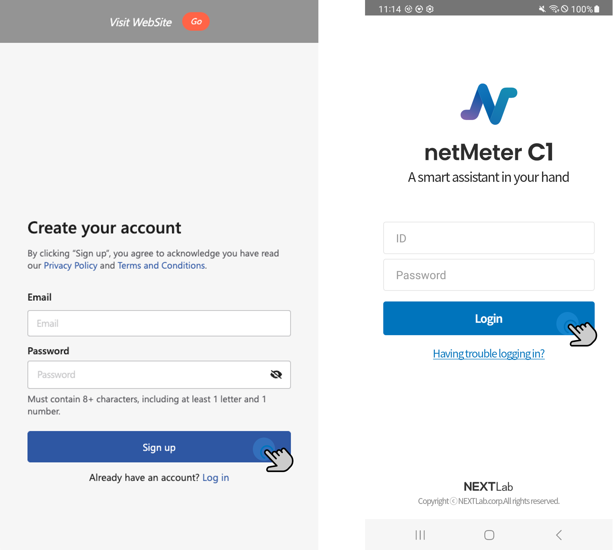

# Getting Started

### Connecting the Device to WAN and Smartphone

The netMeter C1 device operates through its dedicated app (App name: [**netMeter C1**](https://ioctd.netmeter.io)).

Currently, only the Android platform is supported. We recommend downloading the app by accessing the [app download site](https://ioctd.netmeter.io) via the Chrome browser.

Please correctly plug in an internet-connectable LAN cable into the WAN port (RJ-45) of C1 device.
It is located on the back right side of the device.

### Registering account

An account is required to use the C1 app. Please follow the steps below to create an account and log in:

1. Sign up at [netHub](https://app.netmeter.io/register).
2. Log in within the C1 app.
