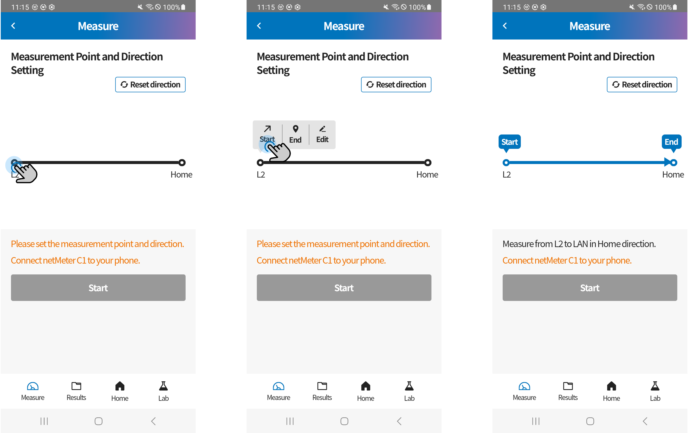
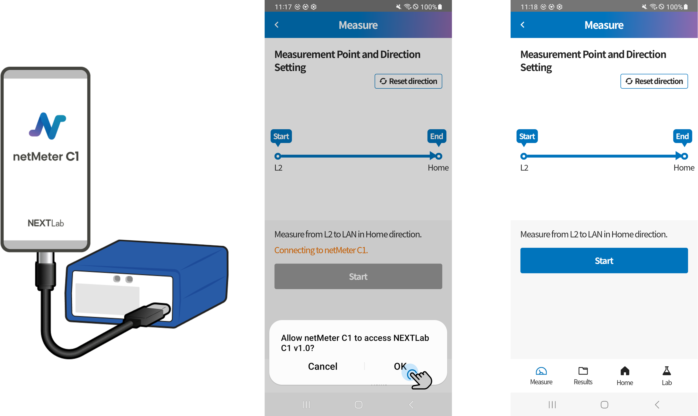
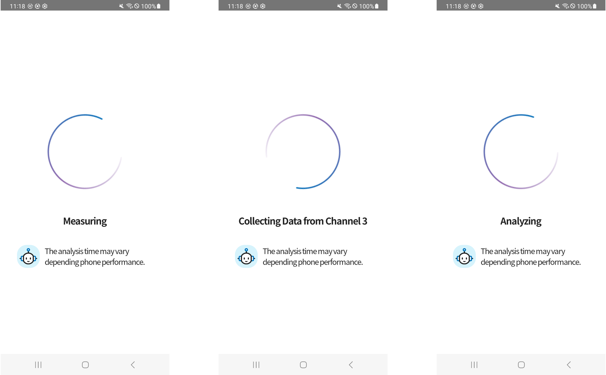

# Cable Test

## Measurement Preparation

### 1. Navigate to the Measure menu.

### 2. Set the start and end points.

- Click either endpoint to set it as the start or end point.
- Click the middle bar section to add an intermediate point.
- The configured location information will be displayed along with the cable's start and end points in the measurement results.

### 3. Connect the smartphone to the C1 device using a C to C cable.

- **Important:** After connecting the cable, be sure to tap OK on the "Allow Device Connection" popup that appears at the bottom of the smartphone screen.

### 4. Start the measurement.

## Line Measurement

- TDR measurement targets all 4 pairs and automatically detects whether the line is in an active or inactive state.
- Do not disconnect the Ethernet cable during measurement.
- Once the measurement is complete, the results will be displayed automatically.
