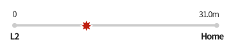
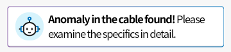
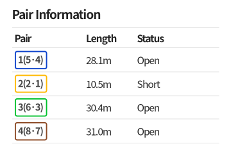
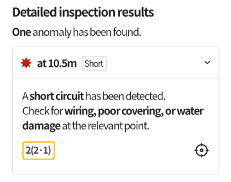
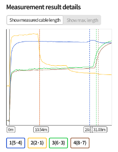
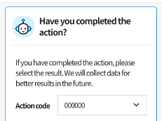

## Viewing Measurement Results

On the measurement results page, you can pinpoint failure cable sections based on TDR measurement data analyzed by AI. Each item provides the following information:

### 1. **Line Graph**

View the overall cable length and points of anomaly on a one-dimensional graph.

### 2. **AI Analysis Summary**

View a summary of the causes of issues detected by AI.

### 3. **Pair Information**

View the length and status of each pair in a table format.

### 4. **Detailed Inspection Results**

View detailed information on detected issues and their causes.

### 5. **Measurement Result Details**

View two-dimensional TDR waveform graphs.
This graph is displayed only when "UI for experts" is enabled in the "Lab" menu.

### 6. **Action Log**

Record actions taken, such as cable replacement, based on the identified issues.
