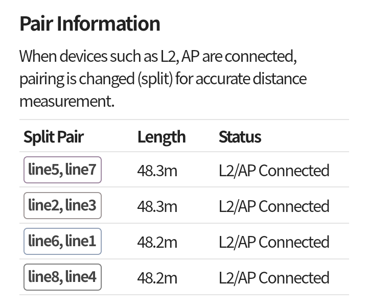

# What is Split Pair?

- If an L2 switch or AP is connected at the far end, the impedance matching circuit (coil) that prevents pair signal reflection may cause inaccurate distance and conductor status measurements.
- In this case, to more accurately pinpoint the problem location, the measurement is performed by swapping the pair combinations. This method of measuring with rearranged pairs is called Split Pair.
